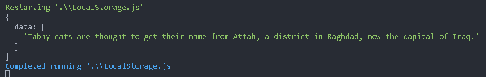
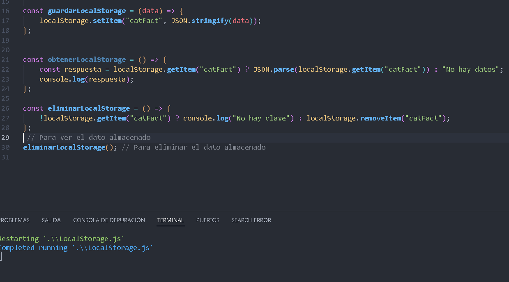
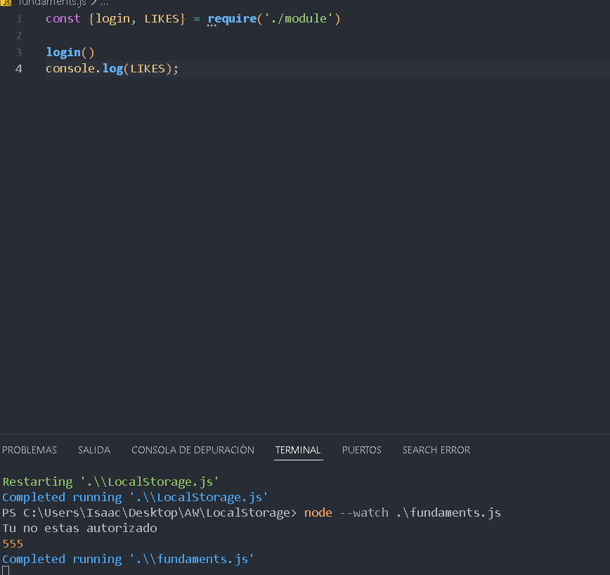
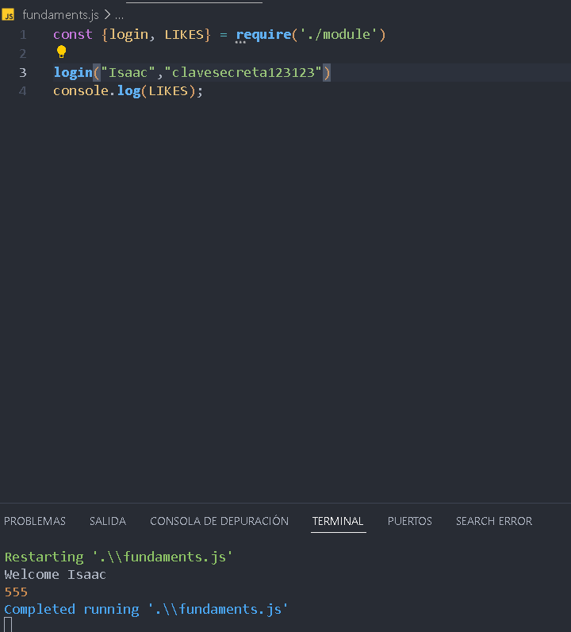
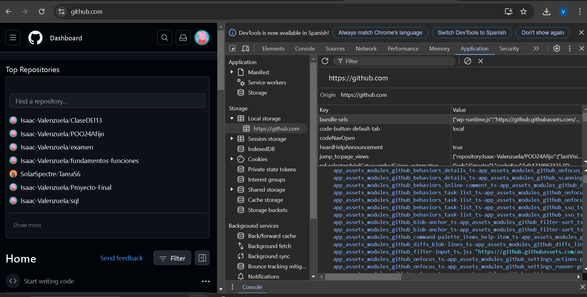

Consumo de la API

Para guardar en el localstorage

Para eliminar del localstorage

Modulos => module y fundaments
-> no autorizado 

-> autorizado con user y password

Local Storage con GITHUB
